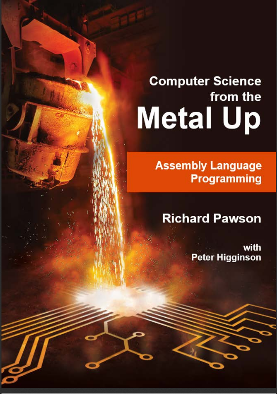

Les ressouces de cette partie sont la **traduction du livre de Richard Pawson** [Assembly language programming (Computer Science from the metal up)](https://peterhigginson.co.uk/ARMlite/Assembly%20Language%20-%20Student%20version.pdf) écris en collaboration avec l'auteur [du simulateur en ligne ARMlite](https://www.peterhigginson.co.uk/ARMlite/) Peter Higginson.

L'objectif est d'*initier un débutant en sciences informatique au langage d'assemblage* par la réalisation de petits jeux entre autre. Un **langage d'assemblage** sert à programmer la machine *au plus près du processeur*.

Apprendre les rudiments d'un tel langage est incontournable pour celles et ceux qui souhaitent **mieux comprendre l'organisation interne d'un ordinateur**.

Même si l'ARMLite (l'ordinateur virtuel) est un simulateur, son auteur a pris soin de rester proche du langage d'assemblage des *processeurs réels* basés sur l'architecture ARM qui équipent la plupart des smartphones actuels.

La **Première partie** (avec exercices corrigés) aborde quelques notions fondamentales des langages d'assemblages, principalement:
- Mémoire principale, registres et l'adressage,
- Opérations arithmétiques et logiques (bit à bit),
- Instructions de manipulation de la mémoire et des registres et instructions de «branchements»,
- La gestion des entrées/sorties: écrire sur l'écran, récupérer une valeur, dessiner un pixel..

La **Deuxième partie** (correction des exercices en cours...) fournie des approfondissements incontournables pour aller plus loin:
- Les différents modes d'adressage: immédiat, direct, indirect, indexé.
- La notion de pile et celle, associée, de sous-routine (sorte de fonction),
- La gestion des interruptions qu'on appelle aussi programmation événementielle.
